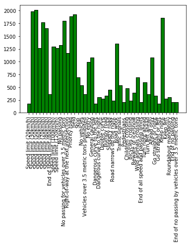
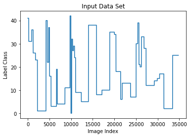
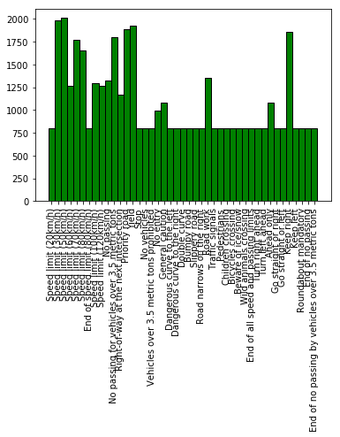
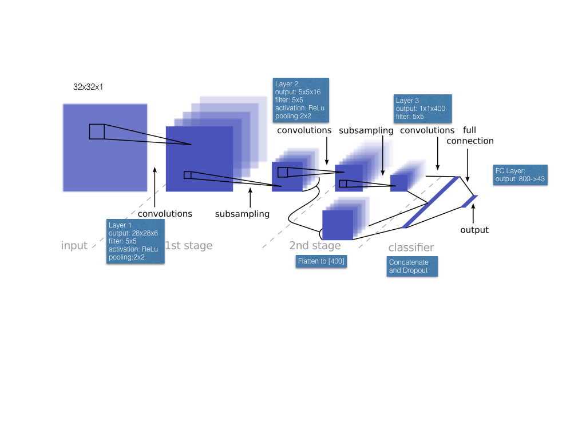
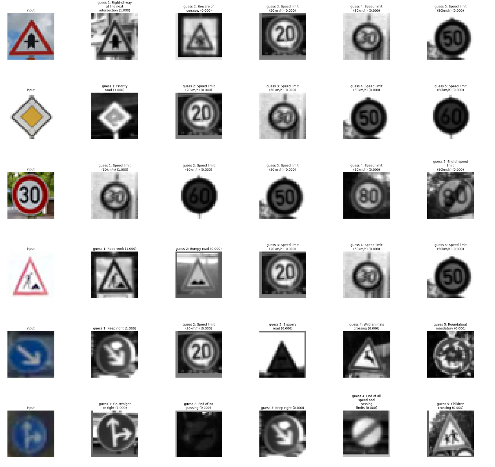

# **Traffic Sign Recognition** 

## Writeup 

### This is the writeup for project 2 submission for the CarND Udacity Program

---

**Objective: Build a Traffic Sign Recognition Project**

The goals / steps of this project are the following:
* Load the data set (see below for links to the project data set)
* Explore, summarize and visualize the data set
* Design, train and test a model architecture
* Use the model to make predictions on new images
* Analyze the softmax probabilities of the new images
* Summarize the results with a written report


## Rubric Points
### Here I will consider the [rubric points](https://review.udacity.com/#!/rubrics/481/view) individually and describe how I addressed each point in my implementation.  

---
### Writeup / README

#### 1. Provide a Writeup / README that includes all the rubric points and how you addressed each one. You can submit your writeup as markdown or pdf. You can use this template as a guide for writing the report. The submission includes the project code.

You're reading it! and here is a link to my [project code](https://github.com/raskolnikov-reborn/CarND-Project-2.git)

### Data Set Summary & Exploration

#### 1. Provide a basic summary of the data set and identify where in your code the summary was done. In the code, the analysis should be done using python, numpy and/or pandas methods rather than hardcoding results manually.

The code for this step is contained in the second code cell of the IPython notebook.  

I used the numpy to calculate summary statistics of the traffic
signs data set:

* Number of training examples = 34799
* Number of testing examples = 12630
* Image data shape = (32, 32, 3)
* Number of classes = 43

#### 2. Include an exploratory visualization of the dataset and identify where the code is in your code file.

The code for this step is contained in the third code cell of the IPython notebook.  

Here is an exploratory visualization of the data set. It is a bar chart showing how the data is distributed among the various target classes/labels

1. I found that the data was not distributed evenly among classes and random sampling and batching of such data would bias the classifier towards the over represented classes.

2. I also plotted the distribution of the data in labels. The distribution indicated that all the labels of one type were clustered together


### Design and Test a Model Architecture

#### 1. Describe how, and identify where in your code, you preprocessed the image data. What tecniques were chosen and why did you choose these techniques? Consider including images showing the output of each preprocessing technique. Pre-processing refers to techniques such as converting to grayscale, normalization, etc.

The code for this step is contained in the fourth code cell of the IPython notebook.

As a first step, I decided to convert the images to grayscale because grayscale models are color invariant. Input images may be captured from different sources with varying levels of color accuracy so a grayscale image is a better input space to train on.

Here is an example of a traffic sign image before and after grayscaling.


As a last step, I normalized the image data because a uniform scale distributed between -1,1 about zero is a better representation for a learning data set than the original input distributed between 0,255 A standardised feature scale will implicitly weight all features equally in their representation.

#### 2. Describe how, and identify where in your code, you set up training, validation and testing data. How much data was in each set? Explain what techniques were used to split the data into these sets. (OPTIONAL: As described in the "Stand Out Suggestions" part of the rubric, if you generated additional data for training, describe why you decided to generate additional data, how you generated the data, identify where in your code, and provide example images of the additional data)

In the download provided with the project materials there were three files, namely, train.p, valid.p and test.p. I used them as the names implied and did not explicitly split more of the training data into validation set. 

The Code for data augmentation is contained in the cells under the header class oversampling in the Ipython notebook
As discussed Earlier oversampling of under-represented classes was done with random mutation and added to the training set to more equalize the class distribution and ensure that each class had at least a minimum number of samples

The sixth code cell of the IPython notebook contains the code for augmenting the data set. I decided to generate additional data because ... To add more data to the the data set, I used the following techniques because ... 


My final training set had 46480 number of images. My validation set and test set had 4410 and 12630 number of images.


The difference between the original data set and the augmented data set is illustrated in the images below



#### 3. Describe, and identify where in your code, what your final model architecture looks like including model type, layers, layer sizes, connectivity, etc.) Consider including a diagram and/or table describing the final model.

The code for my final model is located in the seventh cell of the ipython notebook. 


My final model consisted of the following layers:

| Layer         		|     Description	        					| 
|:---------------------:|:---------------------------------------------:| 
| Input         		| 32x32x1 Normalized Grayscale image   			| 
| ** Convolution 5x5**  | 1x1 stride, same padding, outputs 28x28x6 	|
| activation			| RELU											|
| Max pooling	      	| 2x2 stride,  outputs 14x14x6 				    |
| ** Convolution 5x5**  | 14x14x6 --> 10x10x16      					|
| activation			| RELU											|
| Max pooling	      	| 2x2 stride,  outputs 5x5x16 				    |
| ** Convolution 5x5**  | 5x5x16 --> 1x1x400      					    |
| activation			| RELU											|
| ** Concatenation **   | layer 3 + layer 2 flattened                   |
| ** Dropout **         | 0.5                                           |
| ** Fully connected **	| Input: 800, output 43        					|

#### 4. Describe how, and identify where in your code, you trained your model. The discussion can include the type of optimizer, the batch size, number of epochs and any hyperparameters such as learning rate.

The code for training the model is located in the Train your model here Section of the Ipython notebook

The training pipeline is described as below

| Training Parameter    |     Description	        					| 
|:---------------------:|:---------------------------------------------:| 
| Cross Entropy         | Softmax Logits Cross Entropy                  |
| Loss                  | Reduced mean over CE                          |
| Optimizer             | Adam                                          |
| Training cond.        | Loss minimization                             |
| EPOCHS                | 1000                                          |
| Learning Rate         | 0.0005                                        |
| Batch Size            | 128                                           |

#### 5. Describe the approach taken for finding a solution. Include in the discussion the results on the training, validation and test sets and where in the code these were calculated. Your approach may have been an iterative process, in which case, outline the steps you took to get to the final solution and why you chose those steps. Perhaps your solution involved an already well known implementation or architecture. In this case, discuss why you think the architecture is suitable for the current problem.

The code for calculating the accuracy of the model is located in the Results Section of the Ipython notebook

My final model results were:
* training set accuracy of 100%
* validation set accuracy of 95.5% 
* test set accuracy of 93.7%

If a well known architecture was chosen:
* I chose the architecture desctibed by Lecun et al in 1998
* The architecture is a well known implementation for the traffic sign problem. I also attempted to implement The architecture described by Ciresan et al in http://people.idsia.ch/~juergen/nn2012traffic.pdf but was unable to completely understand it. I'm still working on it and hope to have a working implementation soon.
* How does the final model's accuracy on the training, validation and test set provide evidence that the model is working well? I am not sure if the model is working well. Trying various combinations of the learning rates and EPOCHS and filters, my final results always hovered around the same numbers. I am not sure whether this is due to the face that I didn't clean the data as I should have or whether there is something wrong with my augmentation or implementation of the model in general. I am hoping the reviewer would be able to guide me on how to improve my results.
 

### Test a Model on New Images

#### 1. Choose five German traffic signs found on the web and provide them in the report. For each image, discuss what quality or qualities might be difficult to classify.

I was only able to find 3 uncopyrighted images on the web
I generated the other 3 by using google earth on Munich and snapshotting traffic signs as I found them

 
 
 

Images 1 2 and 3 are of much better quality so shouldnt be hard to classify and the model predicted them correctly all of the time regardless of training parameters.
Images 4, 5 and 6 are more noisy and taken from different angles (not completely frontal) Also they are similar to a lot of other traffic signs for example Road work is quite similar to Children crossing and the keep right as well as go straight or right images may be confused with other similar turn instruction signs 

#### 2. Discuss the model's predictions on these new traffic signs and compare the results to predicting on the test set. Identify where in your code predictions were made. At a minimum, discuss what the predictions were, the accuracy on these new predictions, and compare the accuracy to the accuracy on the test set (OPTIONAL: Discuss the results in more detail as described in the "Stand Out Suggestions" part of the rubric).

The code for making predictions on my final model is located in the tenth cell of the Ipython notebook.

Here are the results of the prediction:


The model was able to correctly guess 6 of the 6 traffic signs, which gives an accuracy of 100%. More challenging images with more noise would probably dip it to around the same number as seen on the test set.

#### 3. Describe how certain the model is when predicting on each of the five new images by looking at the softmax probabilities for each prediction and identify where in your code softmax probabilities were outputted. Provide the top 5 softmax probabilities for each image along with the sign type of each probability. (OPTIONAL: as described in the "Stand Out Suggestions" part of the rubric, visualizations can also be provided such as bar charts)

As seen in the image above, the algorithm was very confident on all of the images. Perhaps more challenging images would shed more light on the different softmax probabilities. However when I was having difficulty in training the model, I was able to see that speed limit signs would be confused between each other as well as turn instructions would be confused


```python

```
